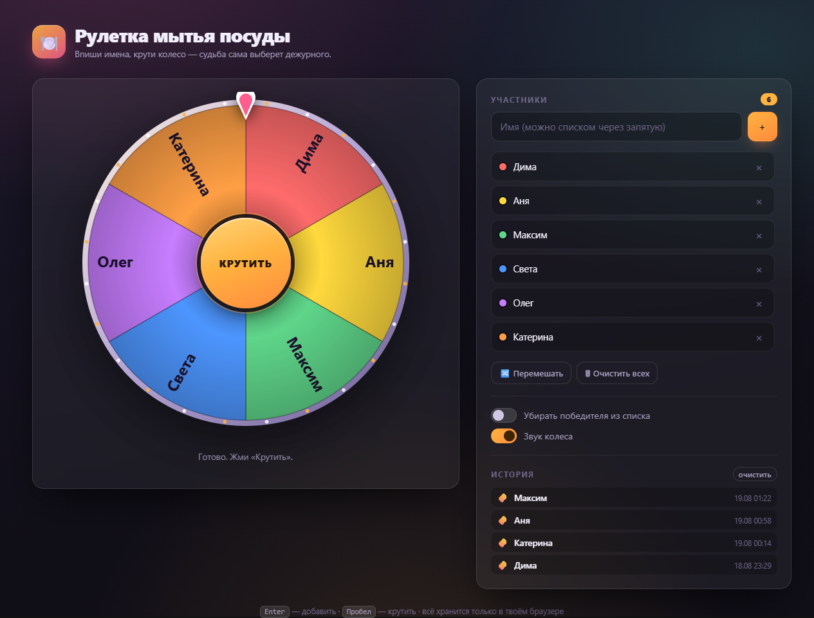
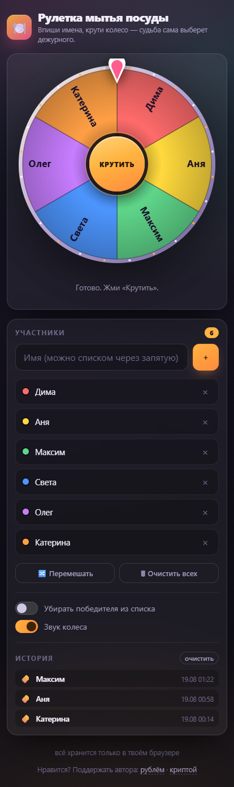
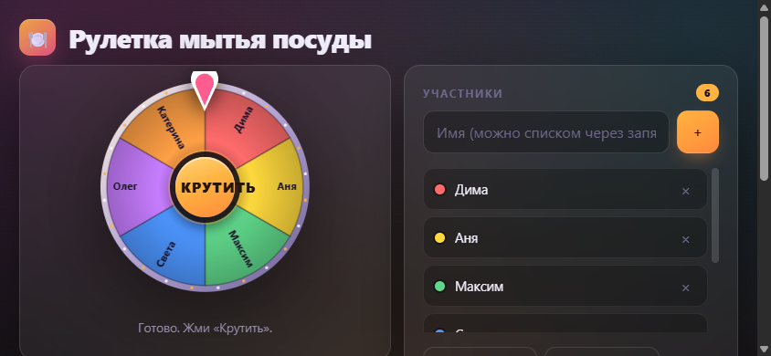

# 🍽️ Рулетка мытья посуды

**Спор о том, кто сегодня моет посуду, решается за пять секунд.**
Вписываешь имена, крутишь колесо — чьё имя выпало, тот и идёт к раковине.

### → **[dosash.github.io/dish-roulette](https://dosash.github.io/dish-roulette/)** ←

---

## Что умеет

🎡 **Честное колесо.** Победитель выбирается через `crypto.getRandomValues`
с отбраковкой остатка — без перекоса в сторону первых секторов, который даёт
наивный `Math.random() * n`. Колесо не «решает» на ходу: имя определяется
до старта анимации, а колесо просто доезжает до нужного сектора.

👥 **Список участников.** Имена добавляются по одному или пачкой — через
запятую, точку с запятой или с новой строки. Дубликаты отсекаются без учёта
регистра, есть перемешивание и удаление по одному.

🔁 **Режим очереди.** Опция «убирать победителя из списка» превращает рулетку
в честную ротацию дежурств: пока все не отмоются, второй раз никто не попадёт.

📜 **История.** Последние 30 розыгрышей с датой и временем — чтобы никто не
говорил «я вчера мыл».

🔊 **Звук и конфетти.** Щелчок на каждом секторе (громкость падает вместе со
скоростью), фанфары победителю, конфетти на весь экран. Всё синтезируется
через Web Audio и Canvas — ни одного медиафайла в репозитории.

⌨️ **Горячие клавиши.** `Enter` — добавить имя, `Пробел` — крутить,
`Esc` — закрыть окно победителя.

📱 **Полноценный телефон.** Не «сжатый десктоп», а отдельная вёрстка —
[подробности ниже](#мобильная-версия).

💾 **Ничего не теряется.** Список, настройки и история лежат в `localStorage`
браузера. Закрыл вкладку — при следующем открытии всё на месте.

---

## Как пользоваться

**Онлайн.** Открыть [dosash.github.io/dish-roulette](https://dosash.github.io/dish-roulette/)
и добавить в закладки. Ничего устанавливать не нужно.

**Локально.** Скачать `index.html`, открыть двойным кликом. Работает из
`file://`, без сервера, без интернета.

**Скинуть другу.** Отправить ему тот же `index.html` в мессенджере — он
откроет его у себя и получит рабочую рулетку. Никакой регистрации, никакого
бэкенда.

---

## Мобильная версия

Телефон — главный сценарий: рулетку обычно открывают прямо на кухне. Поэтому
мобильная вёрстка сделана отдельно, а не получена сжатием десктопной.

<table>
<tr>
<td width="42%" valign="top">

**Портрет — одна колонка**

Колесо сверху, под ним участники, настройки и история. Списки на узких
экранах идут без внутреннего скролла: прокручивается вся страница целиком,
а не рамка внутри рамки.

</td>
<td width="58%" valign="top">

</td>
</tr>
</table>

**Альбом — две колонки.** Повернул телефон — колесо уезжает влево, список
встаёт справа, подзаголовок прячется. Иначе на 390 пикселях высоты пришлось
бы бесконечно скроллить.

**Колесо всегда квадратное и всегда влезает.** Размер считается по меньшей
из трёх величин: `width: min(100%, 520px, 78dvh)` — то есть ширина
контейнера, разумный максимум и доля высоты экрана. В альбоме доля
уменьшается до `62dvh`. Единицы `dvh`, а не `vh` — иначе адресная строка
Safari при скрытии обрезала бы колесо.

**Тач-цели.** В `@media (pointer:coarse)` кнопки, крестики удаления и
переключатели вырастают минимум до 44 пикселей — размер, ниже которого палец
начинает промахиваться.

**Никакого залипшего `:hover`.** На тач-экранах браузер оставляет
`:hover`-стиль после тапа, и кнопка выглядит нажатой, пока не тапнешь мимо.
Блок `@media (hover:none)` возвращает всем интерактивным элементам обычный
вид.

**Мелочи, которые заметны только на телефоне:**

- поле ввода имени — ровно `16px`, иначе iOS зумит страницу при фокусе;
- `touch-action: manipulation` — нет задержки 300 мс и случайного зума
  двойным тапом, нет серой вспышки при касании;
- `env(safe-area-inset-*)` — интерфейс не заезжает под вырез и под домашнюю
  полосу;
- подсказки про `Enter` и `Пробел` скрыты на тач-устройствах: там нет
  клавиатуры, и строка только занимала бы место.

**Можно поставить на домашний экран.** iOS: «Поделиться» → «На экран
«Домой»». Android: меню Chrome → «Добавить на главный экран». Мета-теги
`mobile-web-app-capable` и `apple-mobile-web-app-*` убирают адресную строку —
рулетка запускается как обычное приложение, со своей иконкой и без браузерной
обвязки.

---

## Скриншоты

| Основной экран | Победитель |
|:---:|:---:|
|  |  |

---

## Как устроено

Весь проект — один `index.html`: разметка, стили и логика в одном файле.
Ни сборки, ни `node_modules`, ни CDN. Внешних запросов страница не делает
вообще, поэтому одинаково работает на GitHub Pages, с флешки и из папки
«Загрузки».

Колесо рисуется на `<canvas>`: сектора, обод с лампочками, радиальные
подписи. Подписи в левой половине переворачиваются на 180°, чтобы имена
не читались вверх ногами. Длинные имена обрезаются по реальной ширине
текста и получают многоточие.

Анимация — `requestAnimationFrame` с замедлением `1 - (1 - t)⁴·²`: колесо
долго и красиво доезжает последние градусы. Сектор под стрелкой считается
на каждом кадре, и при его смене играет щелчок и дёргается сама стрелка.

### Если хочется подкрутить

| Что | Где в `index.html` |
|---|---|
| Цвета секторов | константа `PALETTE` |
| Длительность прокрутки | `duration` в функции `spin()` |
| Число оборотов | `turns` в функции `spin()` |
| Ключ хранилища | константа `LS` |
| Палитра интерфейса | CSS-переменные в `:root` |
| Мобильные брейкпоинты | блоки `@media` в конце `<style>` |

---

## Приватность

Данные не покидают браузер: ни аналитики, ни счётчиков, ни сторонних
скриптов, ни единого сетевого запроса. Имена участников хранятся только
в `localStorage` на конкретном устройстве. Чтобы стереть всё — нажать
«Очистить всех» и «очистить» в истории.

---

## Поддержка

Проект бесплатный, без рекламы и без сбора данных. Если рулетка избавила от
спора на кухне — можно сказать спасибо автору:

| | |
|---|---|
| 💳 **Рублём** | [pay.cloudtips.ru/p/894f4248](https://pay.cloudtips.ru/p/894f4248) |
| 🪙 **Криптой** | [Telegram-кошелёк](https://t.me/send?start=IVCyYmLsx06p) |

Те же ссылки есть в подвале самой рулетки. Не обязательно — звёздочка на
репозитории тоже приятна.

---

## Лицензия

[MIT](LICENSE) — бери, меняй, используй как хочешь.
