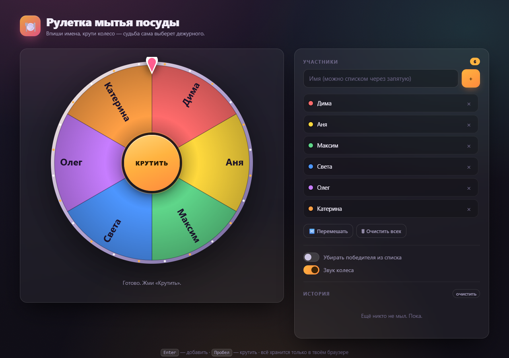

# 🍽️ Рулетка мытья посуды

Одностраничная рулетка: вписываешь имена, крутишь колесо — чьё имя выпадет,
тот и моет посуду.

**Открыть:** https://dosash.github.io/dish-roulette/

## Что умеет

- Колесо на canvas с честным жребием (`crypto.getRandomValues`, а не `Math.random`)
- Добавление имён по одному или списком через запятую / с новой строки
- Список участников с цветными метками и удалением
- Опция «убирать победителя из списка» — удобно для очереди дежурств
- История последних 30 розыгрышей с датой и временем
- Звук колеса (щелчок на каждом секторе) и фанфары победителю — Web Audio, без файлов
- Конфетти при выигрыше
- Всё сохраняется в `localStorage` браузера — никакого сервера и никаких данных наружу
- Горячие клавиши: `Enter` — добавить имя, `Пробел` — крутить, `Esc` — закрыть окно
- Адаптив под телефон, поддержка `prefers-reduced-motion`

## Как пользоваться

Один файл `index.html` без зависимостей. Можно просто скачать и открыть двойным
кликом — работает офлайн, из `file://`, в любом современном браузере.
Или скинуть файл другу — у него откроется точно так же.

## Публикация на GitHub Pages

1. Settings → Pages
2. Source: **Deploy from a branch**
3. Branch: `main`, папка `/ (root)` → Save

Через минуту страница будет доступна по адресу выше.

## Лицензия

MIT
